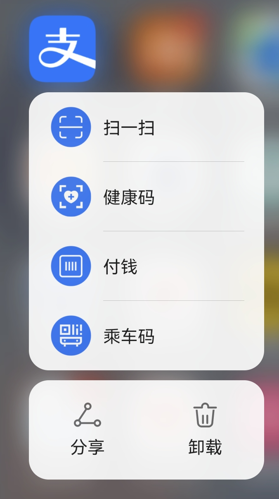

# 电子设备使用手册 

by : yqchang

version: 1.0

license: :copyright:yqchang2207

[TOC]

## 简介

本教程送给您便于查找使用手机、电脑、iPad时常见的功能，如有问题可以直接查看。本手册分为一二两部分。第一部分着重移动设备使用，而第二部分着重电脑使用。

## 手册使用方法

1. 将手册导入到手机阅读软件中，查找相关问题可以使用目录，或者搜索关键字的方法

点这三个点点，可以搜索关键字，看看有没有相关解决方法。

2. 把这个pdf放到电脑上看。
2. 您可以保存这个链接 : [我是链接](https://github.com/ChangYaQi/notes/blob/main/device%20using%20guidence%20for%20the%20elder/guidence%20for%20you.md ) 在手机上看。

## 上篇：手机与iPad使用

### 第一章 常见功能

#### 1.1 网络使用

**两种网络**

 手机/`iPad`有两种可以联网的方式，无线网和移动网络/数据。可以通过下拉手机顶部快捷栏或者通过手机“设置“进入。

无线网联网时候有两种能见到的形式：`WLAN(Wireless Local Area Networks)`和`Wi-Fi`。`WLAN`是一个网络系统，而我们常见的`Wi-Fi`是这个网络系统中的一种技术。所以，`WLAN`和`Wi-Fi`之间是包含关系，`WLAN`包含了`Wi-Fi`。

总而言之，用手机和电脑就看`WLAN`，用`iPad`就看`wifi`。

另外一种就是移动数据。指的是使用[移动设备连接到公共网络，实现互联网访问的方式。移动网络不需要固定的设备进行访问。一般说：流量。这个使用起来手机因为需要收发信号到附近基站，所以功率比较大，所以会有发热现象。

一般，建议在家里（或者在其它有`wifi`的地方）把移动数据关掉。

**热点**

移动数据，俗称热点。同样可以通过下拉手机顶部快捷栏或者通过手机”设置“进入$\to$”个人热点“

这个东西用于：在没有`wifi`但是有一个设备可以<u>使用移动数据</u>，需要让其他设备联网的时候。用法就是：设置名称和密码，您的设备就变成了一个移动的路由。

不用的时候，记得把它关了。因为这个会增大手机发射功率，手机会发热。

#### 1.2 手机设置

1. :scroll:显示与亮度（手机太亮了/太暗了）：这个东西可以调节的，在顶部下拉栏或者手机设置里。

2. :trumpet:声音与振动、静音（手机怎么没声了）：可以通过侧边按钮，顶部下拉栏，手机设置多途径调节。一般而言，振动/静音/响铃三种模式

   

   具体地，可以分别调整图中每一项的音量。它们之间是独立的。

   印版建议您把“来电”这一项方法，“音乐视频游戏“指的是应用内的多媒体播放音量发，根据需要调整。童话是接通电话时候的播放音量。

#### 1.3 软件安装/卸载/升级

1. :shopping:华为手机是华为应用市场，其它的应该也有类似的。

可以搜索想要安装的应用，点击底部最右边->“我的” 可以查看是否有需要更新的软件。

一般建议：非十分必要，请在`Wifi`环境下更新或下载软件。

​     :shopping:`iPad`使用的是`App Store`，两者操作方式基本相同

2. 如果安装了不想要的应用，可以在桌面上通过长按图标，会出现卸载的标志

#### 1.4 不要随便点下载链接

在浏览App（即应用）或者网页时，会出现弹窗，带有下载选项。有时候，上面显示的❌并不能支持我们关掉弹窗，它是家的，可能会让您点进其他网页，还有可能关不掉。多以这个就看运气了，真的点开了那就选择，使用手机home键管理，用任务管理器把它关掉吧！

#### 1.5 骚扰电话加入黑名单

反复被打入的骚扰电话，可以通过在通话记录中->更多选项->将其加入黑名单。

#### 1.6 手机清理

使用任务管理器及时清理运行内存，使用清理软件及时清理聊天记录和缓存（这是手机开电脑的一大元凶）

### 第二章  微信

:happy:微信应该是您最常使用的软件了吧！

#### 2.1  常见的使用问题

1. 如果有人加您好友，会在”新的朋友“这里看到，不一定要通过，可以拒绝，如果您不认识。如果不小心加了，也可以删掉或者直接拉黑。

2. 群聊这一项时“您保存的群聊”，点开有可能什么也没有，因为这个需要在当前任意群聊设置——保存到通讯录 才能找到。如果在**消息界面**选择删除群聊，除非这个群有人重新说话，您是找不到这个群的。【保存的方法：群聊右上角三个点点：“···”$\to$选择保存到通讯录。】

3. 公众号是您关注的公众号，当然也有可能您发现关注了您自己都不记得的东西。原因如下：

   
   
   

您点开了朋友发来的链接，并且不小心点了关注。这个解决方法很简单，找到您不想关注的公众号（消息列表里面显示为订阅号），选择**“不再关注”**

建议还是把不知道怎么关注的东西取关了，因为接受的图片会缓存在手机里，占用空间。

#### 2.2 支付功能

微信支持绑定银行卡、信用卡。支付密码不是您银行卡密码。转账有限额。

微信里面的钱有一种直接储存方式：**钱包**，别人转入您收下的钱都在钱包里。钱包在“我”$\to$“服务”

不要开通的功能：理财通、保险服务。

微信支付的时候，除了在界面内使用“扫一扫”或者“支付码”，还可以长按桌面图标，快捷使用。

:warning:这里的二维码时用来别人添加好友用的，不是支付二维码。

#### 2.3 语音/视频通话功能

视频通话接起后，常见的问题有：

1. 怎么看不见：有可能是接的语音通话，或者转成语音通话了。
2. 怎么镜头反了（不是您想拍摄的内容面）：点击一下屏幕上任意位置，或出现“转换摄像头”选项，

### 第三章 支付宝

#### 3.1 快捷功能

快捷功能和微信类似：

可以迅速打开健康码、扫一扫，或者支付功能（支付码时让其他人扫您的，扫一扫是您扫别人，详见下一小节）

#### 3.2 支付功能

如上所述，支付宝和微信一样，有两种方式：扫一扫和付钱码。可以在应用打开后/或通过快捷功能使用。

支付宝有钱包，但是里面的钱除非来自别人转账的。

支付宝绑定的是银行卡。

:warning:**不要开通**花呗、还呗等奇怪的功能。

#### 3.3 乘车功能

一般应用于“枪带乘车卡/老年卡这种情况”。点击首页“出行”，可以使用电子码坐车。:car::car::car::car::car:

### 第四章 iPad常用功能

:triangular_flag_on_post:**使用首要准则**：记得及时充电，不要让它长时间处于没电状态。

软件更新与下载在`App Store`里面

上网设置在“设置$\to$无线局域网”

如果手机设置了热点，iPad可以连接手机热点，会在无线局域网里显示出来。

### 第五章 防诈骗防上当防中毒指南

陌生号码打进来的一定注意甄别，反复被打就加入黑名单。

不要随便点击别人发来的链接，尤其是封面标题是“中国人一定要看”，”不看不是中国人“，“这个东西很多人都不知道”，“快看马上删”这一类的。

没有根据的“上周美国人/英国人/美国国家科学院/美国药监局/美国知名大学教授说”这一类，基本都是假的。首先是不是他们说的，其次，他们说的和原文一不一样都是未知数。打上这种旗号容易吸引眼球。请您一定注意甄别。

## 下篇：电脑使用

### 第一章 电源使用与开关机的正确方法

#### 1.1 正常情况

开机：如果在这个过程中死机了，请多等待一会。

关机：正确的流程是**开始->关机->==屏幕完全黑掉==显示无信号的时候，再关闭电源**

现在windows10有一个比较讨厌的地方是有可能会让您“更新并关机/更新并重启”，最好选择更新并重启，一位内如果关机了，不能保证下一次能正常开开。重启如果有问题还可以及时解决。以及，**最好别更新**，如果还有关机选项就不要选更新那个选项。

#### 1.2 异常情况

一般情况下，死机是因为某个进程（可能是软件故障导致）异常。我们可以通过手动中断它来结束这个进程。

同时按下键盘的这三个键：

打开任务管理器，右键单击卡死的进程/应用名称，选择结束任务。

没有办法解决的死机解决方式：请长按电源开关，一直按到听见机箱风扇不转了/电脑灭了为止，再重启。

### 第二章 windows10 界面

#### 2.1 基本界面

打开主屏后，可以看到windows徽标，点开就是主菜单了。

电源选项支持您关机或者重启，一般用不到睡眠选项。

设置选项可以进行常见设置，下文（第五章)会详细展开。

右下角会出现的内容有：

联网、设备连接、声音设置、语言设置。

#### 2.2  详细说明

1. 联网：如果没有联网首先看一下这里，有没有wifi标志或者宽带连接标志（即拨号）。

   

2. ==常见键盘使用与输入法问题==

   这里会显示输入法是英文还是中文，右键单击“中/英”这个字可以显示一些详细状况：

   

   比如是全角还是半角输入。全角半角输入是字符占宽的区别。一个汉字字符（包括符号）占用两个字符的位置。英文在半角情况（多数正常情况下）一个英文字母占用一个位置，例如：`abcabc`，但是如果打开了全角输入，那么就会变成：`  ａｂｃａｂｃ`的样子。
   
3. 触发快捷键的方式、输入法翻页的方式等在这里也可以设置，右键“中/英”的标志，进入设置界面。

   比如，默认情况下是这样的：

   

   

### 第三章 软件与系统常见故障/问题 解决方法
#### 3.1 键盘与输入法
这是一个键盘:happy:

a. 数字：数字输入如果右边的小键盘数字输入用不了，大概率是打开了键盘上最右边区域最上方的"NumLock"数字锁定(Number Lock)键：

b. 切换大小写：

假设，我们现在正在使用中文输入，突然变成了全大写的英文字母。

那就意味着，我们出发了大写锁定键，这个在键盘最左侧。

这个键是切换大小写的，即大写字母锁定(**Cap**itals Lock )。因此如果我们想要切换回去，再次按下该键就好了。

c. 切换中英文

切换中英文使用的是：Ctrl和空格键 同时按下

d. 切换全角半角

#### 3.2  其他帮助
出现故障在没有死机的情况下，可以先登录微信，用键盘上的这个标志截图，按一下，然后再微信或者QQ的对话框里粘贴给我。
具体操作：

1. 按下键盘的这个键

   

2. 在和我的聊天框里粘贴，使用`右键单击->粘贴`或者直接使用键盘组合键`ctrl+v`粘贴给我。

   

### 第四章 文件的建立与保存方式

文件建立于保存最好不要在桌面、系统磁盘（C盘）和其它磁盘根目录下。

您可以在DEF盘任何一个盘先建立一个文件夹，然后把东西放在文件夹里。这样会比较乱。

### 第五章 电脑设置

这一部分详细说说，==**设置**==都能干什么。

#### 3.1 基本设置

基本都是您用不太到的功能。

只需要知道设备哪里可以搜索链接蓝牙设备9比如您的手机）即可。

不过，声音这里注意，如果电脑没声了/声太大了是可以在这里调整的。

#### 3.2 网络设置

电脑的网络设置比较复杂，不过一般不会出现什么问题的。正常拨号上网或者连接wifi就可以了。

真的出问题了的话，在不清楚原因的情况下，可以尝试使用360浏览器带的断网急救箱。或者打电话找我吧。

### 第六章 Office的简单使用

您用的最多的应该是Word软件。在使用过程中，除了上一章所说的输入法问题，还有一些其他的问题值得注意。

#### 6.1 防止白费功夫！

为了防止我们由于各种意外情况白写了文档，**第一步**就是要，在一个您能记住的文件夹下右键建立新的文档，最好不要放在桌面上，因为桌面的存储位置是C盘的文档。从存储空间和回复可能性来讲，放在这里都是不合适的。
其次，您一定记得给文档起好名字。不然到时候找文件只能看见这样的场景：

:sweat:这可太苦恼了，根本不知道是什么内容嘛！

**修改文件名称的方式**，右键修改和单击修改，不过千万不要把文件的后缀名"."xxxx给改没了。

**第二步**，有时候word自己会出现一些不可避免地故障，在这种时候，不得不强行关闭它，可是自动回复的保存节点并不知道到底在哪里。为了方式白白写了那么多字，我们应该及时保存文档。快捷键是`"ctrl"+"s"`这两个键同时按下。

#### 6.2 标题栏说明

就是一些格式控制的操作，具体很繁复，需要的时候再说吧。

主要是，在这里，您可以调整字体大小和颜色，使用大纲级别的字体。

#### 6.3 大纲和导航

如果您正确给每一级标题套用了一定的标题级别字体格式，点击`视图->导航窗格`可以便捷地打开大纲列表。

#### 6.4 放缩页面

字体太小看不清，但是不想让整篇文章打印出来的字体变大，可以用最右下角的页面调整或者组合使用键盘快捷键`"ctrl"和"+"或者"-"`来调整试图显示比例。

### 第七章 电脑端QQ与微信的使用

电脑使用QQ微信，您的常见使用功能包括：QQ邮箱，微信和QQ聊天，简单的文件传输。

微信和QQ都可以作为图像传输的工具，在不追求高画质的情况下。不过，这里要注意接受文件的保存位置，默认是在C盘（系统盘），我们可以把它指定到其他位置。

在微信的左下角：

选择**“设置->文件管理”**可以指定想要文件保存的位置。不要放到C盘，放到除了C盘意外任何一个您能找到的盘的目录底下。

QQ的话类似。

使用QQ或者微信的文件传输助手可以在手机和电脑之间**简单传输少量文件**。

电脑端可以选择拖拽文件进入对话框的方式便捷传送。

### 第八章 电脑和手机文件传输

如果需要导出手机照片，或者手机照片发给电脑，电脑上的文件传给手机。

方法1：连上线，看电脑识别出来没有，当作移动盘打开。

方法2：使用360手机助手

扫码连接，**==需要两个设备连接在同一个无线网下！==**

记得选择保存的位置就好。
