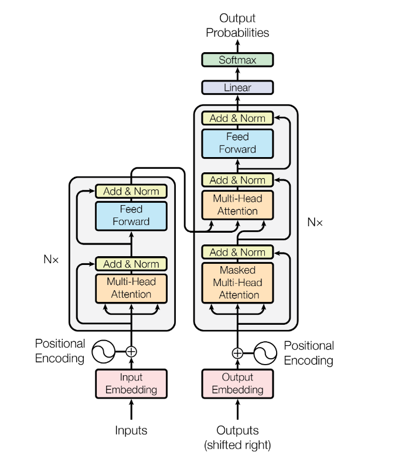

# attention

学习代码：hugging face

首先： torch集成了transformer的各种模型

参照 source-code-notrbook理解

## Transformer的实现原理

模型结构： 

### 1.encoder：输入序列$$x_1,x_2,...x_n$$映射到z表示

6个独立层构成，每层还有两个子层： a. multihead-attention b. fc

*结构函数模块*（encoder decoder subconnrction）用class类表示，class里面可以def相关的功能。功能可以继承。共有的子函数用`def`预先定义出来。

循环的部分用clones 深拷贝

**Q: 深拷贝是啥？**

`copy.deepcopy`

要拷贝类里面所有的功能函数以及参数设置，才能实现功能循环，所以，调用：deepcopy

copy的方法： `for _ in range`

#### encoder：

用`class encoder`写：构成为初始化函数`__init__`和`forward`

其中`__init__`定义层和循环次数

#### decoder：

输出$$y_1,y_2,....,y_n$$

也是6个： attention中进行预测，输出结果送到norm里防止退化，按照层batch_norm

norm使用的参数用

